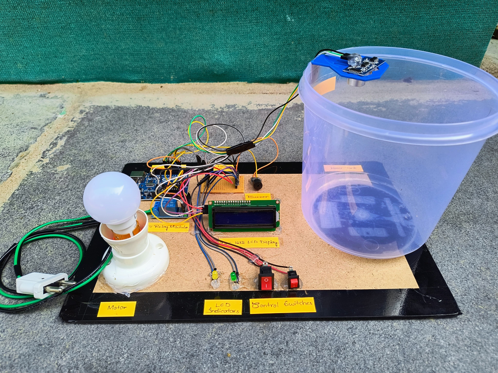

# 💧 Automatic Water Level Controller

**Automatic Water Level Controller** is an Arduino-based embedded automation system designed to efficiently regulate and monitor water levels in storage tanks.  
Using an **ultrasonic sensor**, **relay module**, and **LCD display**, this project automatically controls the pump based on real-time water levels — preventing overflow, dry-run conditions, and water wastage.

---

## 📘 Project Overview

In many households, industries, and agricultural fields, inefficient manual water management often leads to overflow, water scarcity, or pump damage.  
This project aims to automate the process using **Arduino Uno**, which continuously monitors water levels via an ultrasonic sensor and controls the pump using a **relay module**.

The system supports both **Automatic** and **Manual** modes. In **Auto Mode**, the pump operates automatically based on preset levels; in **Manual Mode**, users can override the logic using push buttons.  
An LCD provides real-time water level readings, and a buzzer alerts users during critical conditions.

---

## 🧠 Key Features

- 🔁 **Automatic Water Pump Control** – Turns the pump ON when water is low and OFF when full.  
- 🧠 **Dual Operating Modes** – Automatic and manual switching for flexible operation.  
- 📟 **Real-Time LCD Display** – Shows tank water level percentage and pump status.  
- 📏 **Ultrasonic Sensor Integration** – Accurate non-contact level detection.  
- 🔔 **Buzzer Alerts** – Notifies high or low water levels.  
- 💡 **LED Indicators** – Visual indicators for “Low” and “Full” tank levels.  
- ⚙️ **EEPROM Memory Storage** – Remembers user-defined threshold values even after power reset.  
- 🌍 **Low-Cost and Reliable** – Uses easily available, affordable components.

---

## ⚙️ System Architecture

**Modules Used:**
- **Arduino Uno (ATmega328P)** – Main controller for processing sensor data and controlling relay.
- **Ultrasonic Sensor (HC-SR04)** – Measures the distance between the sensor and the water surface.
- **Relay Module** – Acts as an electronic switch to control the motor or light indicator.
- **LCD Display (16x2)** – Displays the water level percentage and pump state.
- **Push Buttons** – Used for mode selection (Auto/Manual) and manual pump operation.
- **Buzzer & LEDs** – Provide audio-visual alerts for full or low water conditions.

**Operation Flow:**
1. Ultrasonic sensor continuously measures water level.
2. Arduino processes readings and determines tank status.
3. Relay switches ON/OFF automatically or via manual input.
4. LCD updates live readings and pump status.
5. Buzzer and LEDs provide additional feedback.

---

## 💻 Technologies Used

| Component | Function |
|------------|-----------|
| **Arduino UNO** | Central microcontroller handling logic & control |
| **Ultrasonic Sensor (HC-SR04)** | Measures tank water levels (2–400 cm range) |
| **Relay Module (5V)** | Switches pump/light based on Arduino signal |
| **LCD Display (16×2)** | Displays water level percentage & pump status |
| **Push Buttons** | Manual/Auto mode toggle & manual control |
| **Buzzer** | Alerts for critical levels |
| **LEDs (Green & Yellow)** | Indicate Full/Low water status |
| **EEPROM Memory** | Stores last calibration/threshold |

---

## 🧩 Working Principle

1. The **ultrasonic sensor** measures distance to the water surface.  
2. The **Arduino** calculates the percentage level based on tank height.  
3. If the level < 30%, the **relay** turns the pump ON.  
4. If the level ≥ 95%, the **relay** turns the pump OFF.  
5. **LEDs** indicate low (yellow) or full (green) water levels.  
6. **Buzzer** provides single/double beep alerts for critical conditions.  
7. In **Manual Mode**, push buttons let the user override automatic logic.  

---

## 🧰 Hardware Connections (Quick Reference)

| **Arduino Pin** | **Connected Component / Function** |
|-----------------|------------------------------------|
| D3 | Relay Module (Pump / Light Control) |
| D4 | Buzzer |
| D5 | Green LED (Full Tank Indicator) |
| D6 | Mode Switch (Auto / Manual) |
| D7 | Manual Pump Switch |
| D8 | Yellow LED (Low Water Indicator) |
| D9 | Ultrasonic Trigger |
| D10 | Ultrasonic Echo |
| SDA (A4) | I2C LCD Display (Data) |
| SCL (A5) | I2C LCD Display (Clock) |

---

## 🔌 Power Requirements

| Component | Voltage | Current |
|------------|----------|---------|
| Arduino UNO | 5V | 50 mA |
| Ultrasonic Sensor | 5V | 15 mA |
| Relay Module | 5V | 70 mA |
| LCD Display | 5V | 20 mA |
| Buzzer | 5V | 10 mA |

---

## 💾 Code Overview

The Arduino code includes the following key functionalities:

- **EEPROM Storage** for user-set water level calibration.  
- **Median Filter Algorithm** for stable sensor readings.  
- **Auto & Manual Modes** handled via digital switches.  
- **LCD Display** updates in real-time with tank percentage and pump status.  
- **Buzzer & LED Alerts** enhance user feedback.

---

## 📊 Results & Observations

- ✅ Accurate ultrasonic sensing with ±1 cm error.  
- ⚡ Reliable relay operation for motor switching.  
- 🔄 Smooth transition between Auto and Manual modes.  
- 🔔 Buzzer and LEDs respond perfectly to water level thresholds.  
- 🖥️ LCD provided clear and continuous live readings.  

---

## 🌍 Advantages

- Prevents overflow and pump dry-run  
- Saves electricity and water  
- Reduces manual effort  
- Accurate and real-time operation  
- Compact, low-cost, and easily replicable  

---

## ⚠️ Limitations

- Minor fluctuations due to ultrasonic interference  
- Requires regular calibration for best accuracy  
- Not IoT-enabled (offline operation only)  

---

## 🚀 Future Enhancements

- ☁️ **IoT Connectivity** for cloud-based monitoring via Blynk or Firebase  
- 🤖 **AI-Based Prediction** for pump scheduling based on consumption trends  
- ☀️ **Solar Integration** for sustainable power supply  
- 💧 **Leakage Detection** using flow or pressure sensors  
- 🏢 **Multi-Tank Management** for apartment and industrial setups  

---

## 👨‍🔧 Developed by  

**👨‍🔧 Merugumala Rabbuni**  
🎓 B.Tech in Electrical & Electronics Engineering (EEE)  
🔗 [GitHub](https://github.com/rabbunimerugumala)  
💼 [LinkedIn](https://www.linkedin.com/in/merugumala-rabbuni)

---

## 🪴 License

This project is released under the **MIT License** — free to use, modify, and distribute with proper attribution.

---

### ⭐ If you found this project helpful, consider giving it a star on GitHub!
